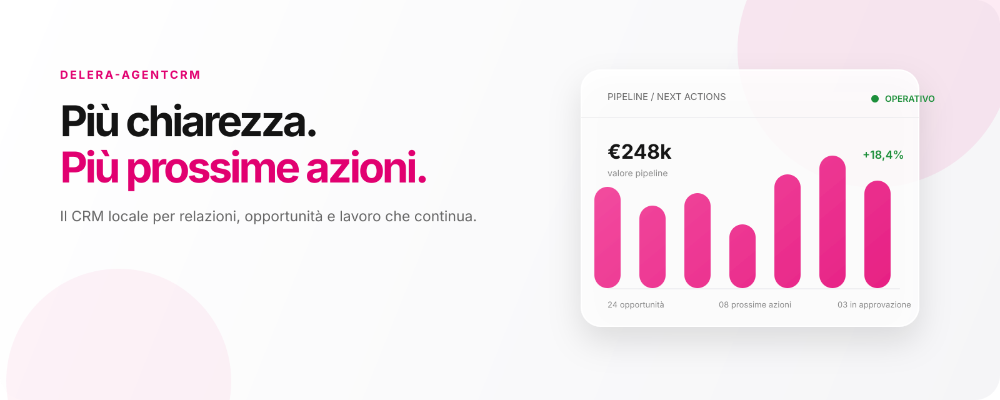
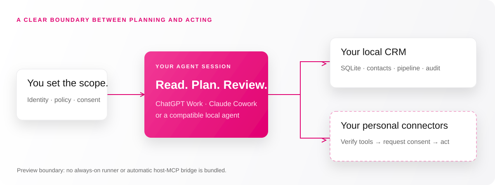

<div align="center">



# Delera-AgentCRM

### The local-first AI CRM starter that begins with a folder.

**Your relationships. Your workspace. An agent to help you follow through.**

[](#whats-ready)
[](src/)
[](docs/PRIVACY.md)
[](docs/VERIFICATION.md)

[**Visit the website ↗**](https://delera-agentcrm.vercel.app) · [**Get started**](docs/QUICKSTART.md) · [**Download ZIP**](https://github.com/uppifyagency/Delera-AgentCRM/archive/refs/heads/main.zip) · [**Italiano**](README.it.md)

</div>

---

Delera-AgentCRM is a **portable, agent-assisted CRM** for people who want a cleaner sales pipeline without handing their customer context to another hosted CRM service. Give a compatible agent access to the folder, personalize your workspace, and start with a working local database, a synthetic demo and a clear operating playbook.

Designed for **ChatGPT Work, Claude Cowork, Codex and compatible agents** with persistent file access and command execution. Personal connector setup and host compatibility must be verified; cross-host end-to-end certification is not claimed.

> **Development preview · v0.2.0-preview.** The local core works. The twelve workflows are documented procedures with partial planning support—not twelve running automations. Complete Google executors, bidirectional sync and an always-on runner remain in development. The generic live planner executor is disabled.

## Why Delera-AgentCRM?

<table>
<tr><td width="50%"><h3>01 · A workspace you can inspect</h3><p>Contacts, companies, opportunities, tasks and activities in a local SQLite core. Clear files, a portable setup and no bundled credentials.</p></td><td width="50%"><h3>02 · A pipeline with a next step</h3><p>Audit missing next actions, overdue tasks and stalled opportunities. Turn a dry-run plan into a focused review, not a flood of notifications.</p></td></tr>
<tr><td><h3>03 · Connect on your terms</h3><p>Reuse the tools already verified in your agent session. Request missing authorizations one at a time, using your own Google accounts.</p></td><td><h3>04 · Autonomy with boundaries</h3><p>Keep sources, versions and receipts. Draft before sending. Require approval for customer-facing actions, sharing and consequential changes.</p></td></tr>
</table>

## Start in three steps

1. **[Download the folder](https://github.com/uppifyagency/Delera-AgentCRM/archive/refs/heads/main.zip)** or clone this repository into a fresh workspace.
2. **Give your agent access** to that folder. Use a host with persistent files, command execution and Node.js **22.23+ in the 22.x series**.
3. **Ask the agent to begin:**

```text
Read START_HERE.md and docs/AGENT_PLAYBOOK.md.
Start my Delera-AgentCRM from this folder. Check the environment,
ask only for missing personal setup, and show the local demo first.
Verify existing connectors before requesting new authorizations,
one at a time. Do not send messages or change external accounts
without the required approval.
```

The agent handles supported technical steps; you provide organization, owner email, timezone and personal consent. Never paste passwords, MFA codes or tokens into chat.

**Prefer the command line?**

```bash
git clone https://github.com/uppifyagency/Delera-AgentCRM.git
cd Delera-AgentCRM
node scripts/start.mjs doctor
node scripts/start.mjs
```

The launcher installs locked dependencies if needed, compiles and asks for a personal profile. After setup, use `npm run demo` for synthetic data or `node dist/src/agentcrm.js audit` for a local pipeline audit. See the [English quickstart](docs/QUICKSTART.md) and [command reference](docs/COMMANDS.md).

## How it fits together



The agent is the orchestration layer. The CRM process does **not** inherit the host app's MCP connections. A connector listed in a catalog is not proof of access; a saved OAuth grant is not proof of a working workflow.

## Twelve workflows, one relationship story

| Journey | Workflow | Preview coverage |
| --- | --- | --- |
| Capture | 01 · Gmail → lead/contact | Candidate planner + local CRUD |
| Connect context | 02 · Email → opportunity | Procedure + linked activities; no complete matcher |
| Follow through | 03 · Email → follow-up task | Planning; external task execution incomplete |
| Remember meetings | 04 · Calendar → CRM activity | Local activity core; no continuous trigger |
| Find next actions | 05 · Meeting → notes/actions | Plan/template intention; notes need real sources |
| Prepare a proposal | 06 · Opportunity → Docs/Drive | Procedure + proposal intention |
| Send deliberately | 07 · Proposal → approved email | Approval primitives; no wired Gmail dispatcher |
| Keep tasks aligned | 08 · CRM ↔ Google Tasks | Typed adapters with mock tests; sync incomplete |
| Keep contacts clean | 09 · Contacts ↔ CRM | Preliminary adapters/dedup; sync incomplete |
| See the pipeline | 10 · Pipeline → Sheets/forecast | Local audit; export/forecast not implemented |
| Surface stalled work | 11 · Inactivity → reminders | Local audit and review planning; no scheduler |
| Close the loop | 12 · Won/lost → reconciliation | Local CRUD + reconciliation planning |

[Read every procedure, guardrail and missing piece →](docs/WORKFLOWS.md)

## What's ready

| Available locally | Requires setup or further implementation |
| --- | --- |
| Typed CRM records and organization-scoped access | Personal Google / host-app authorization |
| Optimistic version checks and linked activities | Full Gmail and Calendar event ingestion |
| Pipeline health checks and dry-run planning | Durable MCP bridge and always-on execution |
| Personal onboarding and isolated demo | Complete Tasks/Contacts conflict-safe sync |
| Provenance, approval and recovery primitives | End-to-end Docs/Drive/Sheets workflows |
| Credential vault and encrypted database backups | New-account Work/Cowork and cross-OS validation |

**Verification:** 36 core tests passed during release preparation; clean installation, relocated paths, repeatable demo and data-free re-export also passed. Google adapters are tested with mocks. [Evidence and limits](docs/VERIFICATION.md) · [Technical review](docs/REVIEW.md).

## Your tools, verified individually

**Core connector targets:** Gmail · Google Calendar · Drive · Docs · Sheets · Tasks · Contacts.

**Optional host capabilities:** Slack · Google Slides · Documents · PDF · Spreadsheets · Presentations · Sites.

The package includes a read/write capability map and incremental authorization procedure. It does not install or authenticate these products. If a Google Tasks plugin is unavailable, local tasks remain usable; a desktop OAuth component is documented as an integration path, not a ready-made universal plugin.

[Connector map](docs/CONNECTORS.md) · [OAuth flow](docs/OAUTH.md) · [Compatibility](docs/COMPATIBILITY.md)

## Privacy is a boundary, not a badge

- Runtime data lives in `.agentcrm/`; demo data lives in `.agentcrm-demo/`. Neither belongs in Git or a shared starter.
- **The live SQLite database is not encrypted.** Filesystem permissions and device security matter.
- Backups are encrypted. Vault encryption does not protect against someone obtaining both the vault and its local master key.
- The clean exporter excludes runtime data, secrets, dependencies and compiled output. Review custom source edits before sharing.
- The public landing page is a project presentation. It does not host your CRM or receive your customer records.

[Read the complete privacy and backup guide →](docs/PRIVACY.md)

## Development

```bash
npm ci
npm run verify      # Core tests + clean install / portability checks
npm run build:site  # Static landing page; no CRM data deployed
npm run test:site   # Metadata, links and public-output checks
```

The CRM uses TypeScript, SQLite and Zod, with Google API integration components. The landing page uses static HTML, CSS, SVG and a small clipboard helper—no frontend framework or analytics required.

| Directory | Purpose |
| --- | --- |
| `src/`, `test/` | CRM core and tests |
| `docs/`, `examples/` | Operating playbook, reference and synthetic inputs |
| `assets/` | Repository cover, logo and architecture SVGs |
| `website/` | Public landing-page source |
| `scripts/` | Startup, verification and clean export |

## Roadmap & contributing

Next: durable event IDs and transactional outbox → provider-specific dispatch and receipts → conflict-safe Tasks/Contacts synchronization → incremental Gmail/Calendar ingestion → document/report workflows → verified scheduling.

Contributions should make one boundary measurably stronger. See [CONTRIBUTING.md](CONTRIBUTING.md), [SECURITY.md](SECURITY.md) and the [open issues](https://github.com/uppifyagency/Delera-AgentCRM/issues). **Never submit real customer data or credentials.**

**License:** a reuse license has not yet been selected. Public visibility alone is not an open-source license. See GitHub's repository permissions and request permission from the maintainer before reuse beyond those permissions.

---

<div align="center">

**Less chasing. More follow-through.**

Built by [uppifyagency](https://github.com/uppifyagency) · [Website](https://delera-agentcrm.vercel.app) · [Get started](docs/QUICKSTART.md) · [Italiano](README.it.md)

</div>
